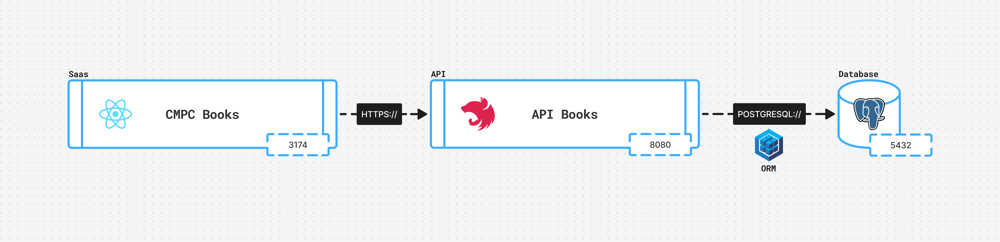
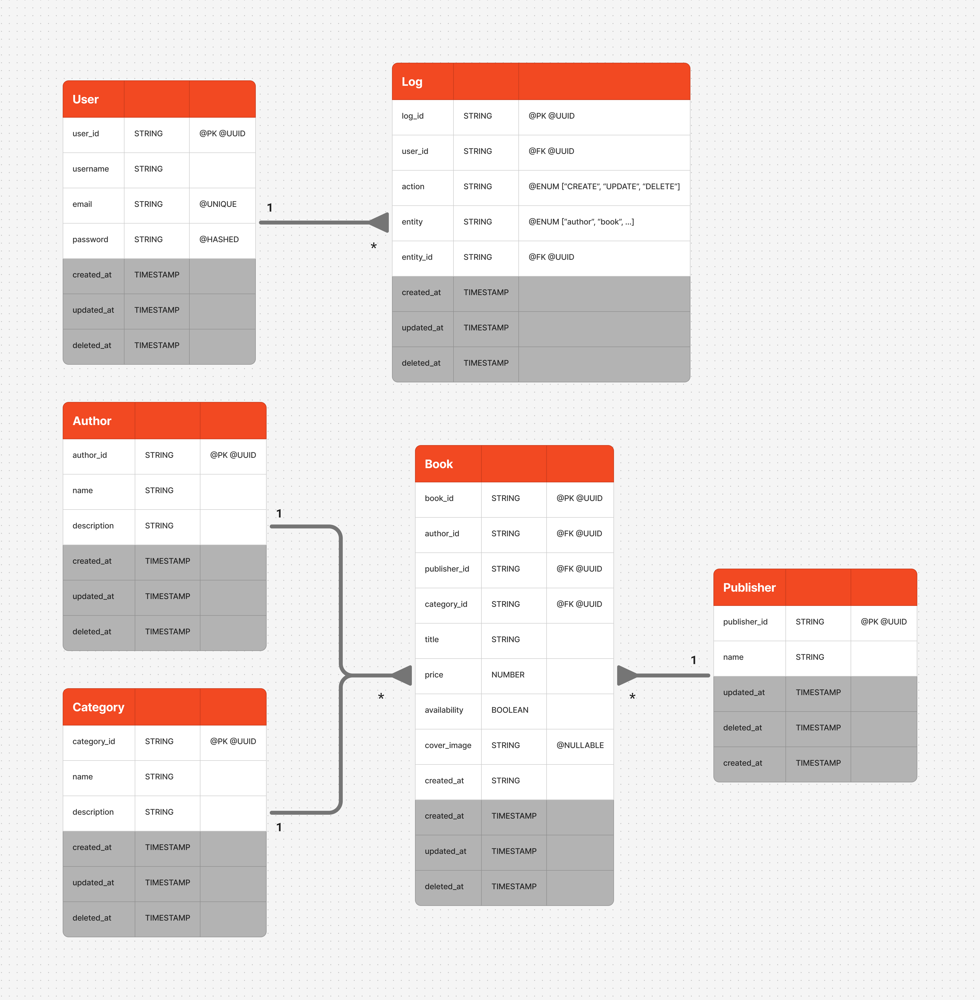

# CMPC Books

## 🐳 Arquitectura del proyecto



## 🏛️ Modelo entidad relación



## 🚀 Ejecucion

Clonar el repositorio:

```bash
  # Clonar el repositorio
  $git clone
```

Copiar el archivo `.env.template` a `.env` y completar las variables de entorno necesarias:

```bash
  # Copiar el archivo de plantilla de variables de entorno
  $cp .env.template .env
```

Correr el proyecto en base al archivo `docker-compose.yaml`:

```bash
  # Construir y correr los contenedores en segundo plano
  $docker compose up --build -d
```

Credenciales por defecto:
- User: admin@cmpc.com
- Password: asd123


En caso de querer detener los contenedores

```bash
  # Detener los contenedores
  $docker compose down
```

## 🔮 Docs

Imagen de PostgreSQL en Docker Hub:
[Postgres Docker Hub](https://hub.docker.com/_/postgres)

```bash
  $docker pull postgres:14.18
```
